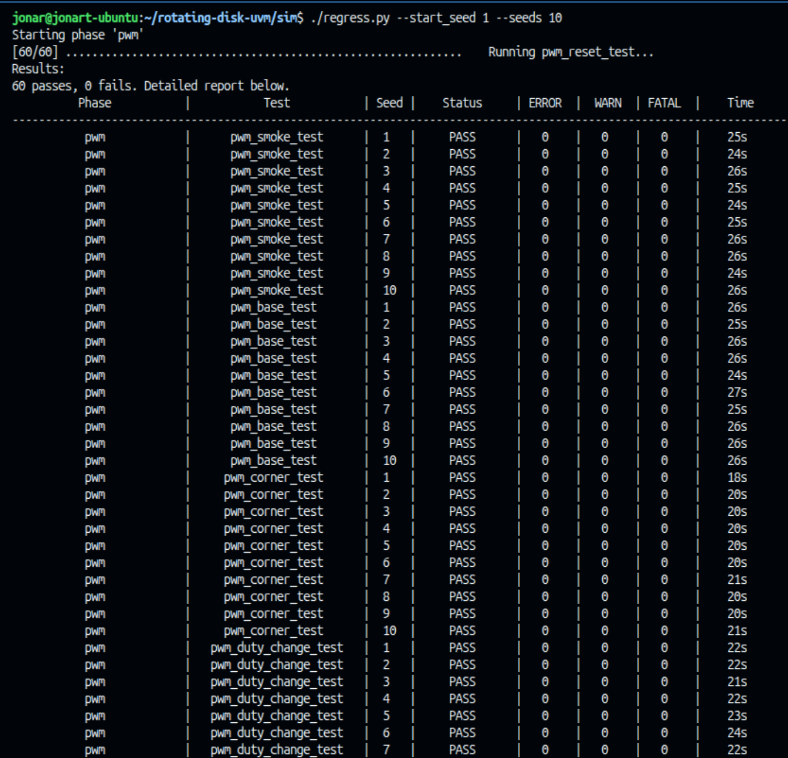

# Rotating Disk Controller — UVM Verification Environment

A UVM testbench for a proportional position controller for a rotating disk: a quadrature
encoder decoder, a magnitude clamp, an N-bit PWM generator, and the closed-loop controller
that ties them together. Constrained-random stimulus, self-checking scoreboards against
golden models, SystemVerilog assertions bound to the RTL, and functional coverage, all
running on Vivado XSim.

> ### ⚠️ Status: Phase A works, the rest is not built
>
> Phase A (`pwm_n_bit`) is a working self-checking UVM environment — interface, agent,
> monitor, scoreboard and a constrained-random test that runs clean against the golden
> model. Functional coverage is half-wired and the assertions are not written yet. Phases
> B, C and D — the magnitude clamp, the quadrature decoder and the integrated controller —
> are still empty stubs.
> **The commands below describe how the whole thing is meant to be driven once it is
> built**; outside Phase A most of them will not do anything useful. See
> [Current state](#current-state) for what actually runs.

---

## About this project

This is a **learning project**. I am teaching myself UVM, and I am not a professional
verification engineer — expect things that a practitioner would do differently, and expect
the structure to change as I learn why it should.

**Every line of code in this repo is written by me.** I used Claude for the surrounding
work: planning the build order, explaining concepts, reviewing my reasoning, and writing
the private study notes I work from. The testbench itself — interfaces, agents, golden
models, assertions, covergroups, tests — is mine, typed out by hand, because writing it is
the entire point of the exercise.

The `rtl/` directory is a vendored copy of my own coursework design (see
[`rtl/PROVENANCE.md`](rtl/PROVENANCE.md) for the exact source commit and the two local
changes made to it). It is the device under test, not part of the verification work.

---

## Requirements

| | |
|---|---|
| Simulator | Vivado XSim, 2025.2 (any recent release should work) |
| UVM | UVM-1.2, the copy that ships with Vivado — nothing to install |
| Build | GNU make, Python 3.12+ for the regression runner |

The Makefile looks for Vivado under `$HOME/Vivado/2025.2`. Point it elsewhere with
`XILINX_ROOT`, either per-invocation or in your environment:

```sh
make XILINX_ROOT=/tools/Xilinx/Vivado/2024.1
```

Vivado does not have to be on your `PATH`; the Makefile calls `xvlog`, `xelab`, `xsim` and
`xcrg` by absolute path.

---

## Running a simulation

Everything is driven from the `sim/` directory.

```sh
cd sim
make                    # compile + elaborate + run the default test
```

`make` is compile → elaborate → run in one step; `make compile` and `make elab` stop early
if you only want to check that things build.

### Choosing what to run

The testbench is split into four independent phases, one per device under test. Select one
with `PHASE`, and a test within it with `TEST`:

```sh
make PHASE=pwm                          # the default
make PHASE=clamp TEST=clamp_random_test
make PHASE=quad  TEST=quad_direction_test SEED=42
make PHASE=ctrl  TEST=ctrl_step_response_test VERBOSITY=UVM_HIGH
```

| Knob | Values | Default | What it does |
|---|---|---|---|
| `PHASE` | `pwm`, `clamp`, `quad`, `ctrl` | `pwm` | Picks the DUT, its filelist and its testbench top |
| `TEST` | a UVM test class name | `<PHASE>_base_test` | Passed through as `+UVM_TESTNAME` |
| `SEED` | integer | `1` | Randomization seed (`-sv_seed`) |
| `VERBOSITY` | `UVM_LOW`, `UVM_MEDIUM`, `UVM_HIGH`, `UVM_DEBUG` | `UVM_HIGH` | UVM report verbosity |
| `WAVES` | `0`, `1` | `0` | Dump a waveform database |
| `COV` | `0`, `1` | `0` | Collect functional coverage |
| `TIMEOUT` | a delay | `20ms` | Global watchdog, read as `+UVM_TIMEOUT` |
| `XILINX_ROOT` | path | `$HOME/Vivado/2025.2` | Where Vivado lives |

`make help` prints the same list.

Which DUT each phase drives:

| Phase | DUT | What it is |
|---|---|---|
| `pwm` | `pwm_n_bit` | N-bit PWM generator with a duty deadband |
| `clamp` | `magnitude_clamp` | Combinational saturation of a signed command |
| `quad` | `decoder_to_32_bit` | Quadrature encoder decoder — a protocol, not a value |
| `ctrl` | `prop_ctrl_pwm` | The whole proportional loop, integrating the blocks above |

Out of scope, and unverified on purpose: `enel453_lab_initializer`, `debounce`,
`status_7seg`, and the ROM playback path.

### Logs

Every run writes to `sim/logs/`:

```
logs/xvlog.<phase>.log            compile
logs/xelab.<phase>.log            elaboration
logs/<phase>.<test>.<seed>.log    simulation
```

A run passed if the UVM report summary at the end of the simulation log shows no
`UVM_ERROR` or `UVM_FATAL`. Check it before believing an exit code.

### Waveforms

```sh
make WAVES=1                            # batch run, dumps logs/<phase>_<test>_<seed>.wdb
make gui                                # interactive, opens the XSim GUI
```

`WAVES=1` elaborates with `-debug typical` and runs `waves.tcl`, which decides what gets
dumped. Open a saved database later with:

```sh
xsim --gui logs/pwm_pwm_base_test_1.wdb
```

### Coverage

```sh
make COV=1 PHASE=pwm TEST=pwm_base_test SEED=1
make COV=1 PHASE=pwm TEST=pwm_base_test SEED=2
make cov                                # merge everything into cov_report/
```

Each `COV=1` run drops a database in `sim/xsim.covdb/` named
`<phase>_<test>_<seed>`; `make cov` merges whatever is there into an HTML report at
`sim/cov_report/index.html`. The `xcrg` flags differ between Vivado releases — if the merge
fails, `xcrg -help` is the place to look.

### Regressions

`sim/regress.py` runs every test in a phase across a range of seeds, one after another, and
prints a pass/fail table at the end.

```sh
cd sim
./regress.py                                        # every test, seed 0 only
./regress.py --start_seed 1 --seeds 10              # every test, seeds 1–10
./regress.py --phase pwm --test pwm_corner_test --seeds 50
./regress.py --clear                                # empty sim/logs/ and exit
```



| Flag | Default | What it does |
|---|---|---|
| `--phase` | every phase | Restrict to one phase; repeatable. Only `pwm` has tests today |
| `--test` | every test in the phase | Run one test class instead of the whole list |
| `--start_seed` | `0` | First seed, inclusive |
| `--seeds` | `1` | How many consecutive seeds to run |
| `--cov` | off | Meant to collect coverage on every run — not wired up yet |
| `--clear` | — | Delete everything in `sim/logs/` and exit without running |

The progress bar prints `.` for a pass and `X` for anything else. The status comes from each
run's UVM report summary, not from the exit code:

| Status | Meaning |
|---|---|
| `PASS` | Report summary present, `UVM_ERROR` and `UVM_FATAL` both 0 |
| `FAIL` | At least one `UVM_ERROR` or `UVM_FATAL` |
| `NOREPORT` | No report summary: the simulation crashed, hung, or never started the test |
| `TOOLFAIL` | `make` itself failed, usually a compile or elaboration error |

Every run still writes its own `sim/logs/<phase>.<test>.<seed>.log`, so a failing row can be
opened directly or re-run alone with `make PHASE=<phase> TEST=<test> SEED=<seed>`. A Phase A
test takes 20–27 s, so the ten-seed run above takes about 25 minutes. The script always
exits 0 for now, so read the table.

### Cleaning up

```sh
make clean                              # build artifacts, logs, waveforms
make veryclean                          # also coverage databases and reports
```

---

## Current state

What actually runs today, on Vivado 2025.2:

- **UVM smoke test** — proves the UVM library elaborates and runs under XSim:

  ```sh
  cd sim && make PHASE=hello TOP=tb_hello TEST=hello_test
  ```

  Prints `UVM is alive on XSim` and exits. (`TOP` has to be given explicitly here because
  this top is named `tb_hello`, not `tb_hello_top`.)

- **Golden model** — `tb/common/dut_pkg.sv` is real: `expected_pwm_high(duty, threshold)`
  and `pwm_period(bits)`, pure functions with no UVM dependency. Hand-checked against a
  table of duty values by a throwaway top in `tb/top/scrap/`.

- **Phase A runs end to end and checks itself.**

  ```sh
  cd sim && make PHASE=pwm TEST=pwm_base_test
  ```

  Compiles, elaborates and runs clean — `UVM_ERROR : 0`, with the scoreboard reporting on
  50 randomized duty values. The whole loop is in place:

  - `tb/common/pwm_if.sv` — one interface with `drv_cb` / `mon_cb` clocking blocks and a
    wide `MAX_BITS` bus the top narrows to the DUT's parameter.
  - `tb/top/tb_pwm_top.sv` — clock, DUT, interface, and the `uvm_config_db` handoff of
    `vif`, `BITS` and `THRESHOLD` before `run_test()`.
  - `tb/agents/pwm_agent/` — `pwm_item` (constrained `duty` and `hold_periods`),
    `pwm_driver`, `pwm_monitor`, a typedef'd sequencer and `pwm_agent`, all `` `include ``d
    into `pwm_agent_pkg.sv`. The driver and sequencer are gated on `get_is_active()`, so
    the agent is already usable passively — which is what Phase D needs.
  - `tb/env/pwm_env.sv` + `pwm_scoreboard.sv` — the monitor's analysis port fans out to a
    scoreboard that checks every completed period against `dut_pkg::expected_pwm_high`.
  - `tb/tests/` — `pwm_base_seq` and `pwm_base_test`.

  The monitor integrates `pwm_out` over a full `2**BITS` period and marks periods where
  `duty` moved mid-period; the scoreboard skips those rather than scoring them.

- **Functional coverage (Step A7) — in progress.** `tb/env/pwm_coverage.sv` is written and
  `pwm_env` creates and connects it, but it is not yet `` `include ``d in
  `pwm_env_pkg.sv`, so nothing compiles it and the run above reports no coverage yet.

Still empty: the `clamp`, `quad` and `ctrl` interfaces, environments, test packages and
tops; every assertion module and `bind_all.sv`; and three of the five filelists.
`PHASE=clamp`, `quad` and `ctrl` will not build.

---

## Repository layout

```
rtl/                    Device under test — vendored, see PROVENANCE.md
tb/
  common/               Interfaces, shared types, DUT golden-model functions
    sva/                Assertion modules, bound to the RTL without editing it
  agents/               One UVM agent per interface protocol
  env/                  Per-phase environments: agents + scoreboard + coverage
  tests/                Sequences and tests
  top/                  Per-phase testbench tops — clock, DUT, interface, run_test
    scrap/              Throwaway experiments with their own Makefile — gitignored
sim/
  Makefile              The build; see `make help`
  filelists/            One compile filelist per phase
  regress.py            Seeded regression runner, see Regressions above
  waves.tcl             What to dump when WAVES=1
```

Assertions live in separate modules attached with `bind`, so the RTL in `rtl/` stays
exactly as it synthesizes — no testbench code is ever added to a design file.
