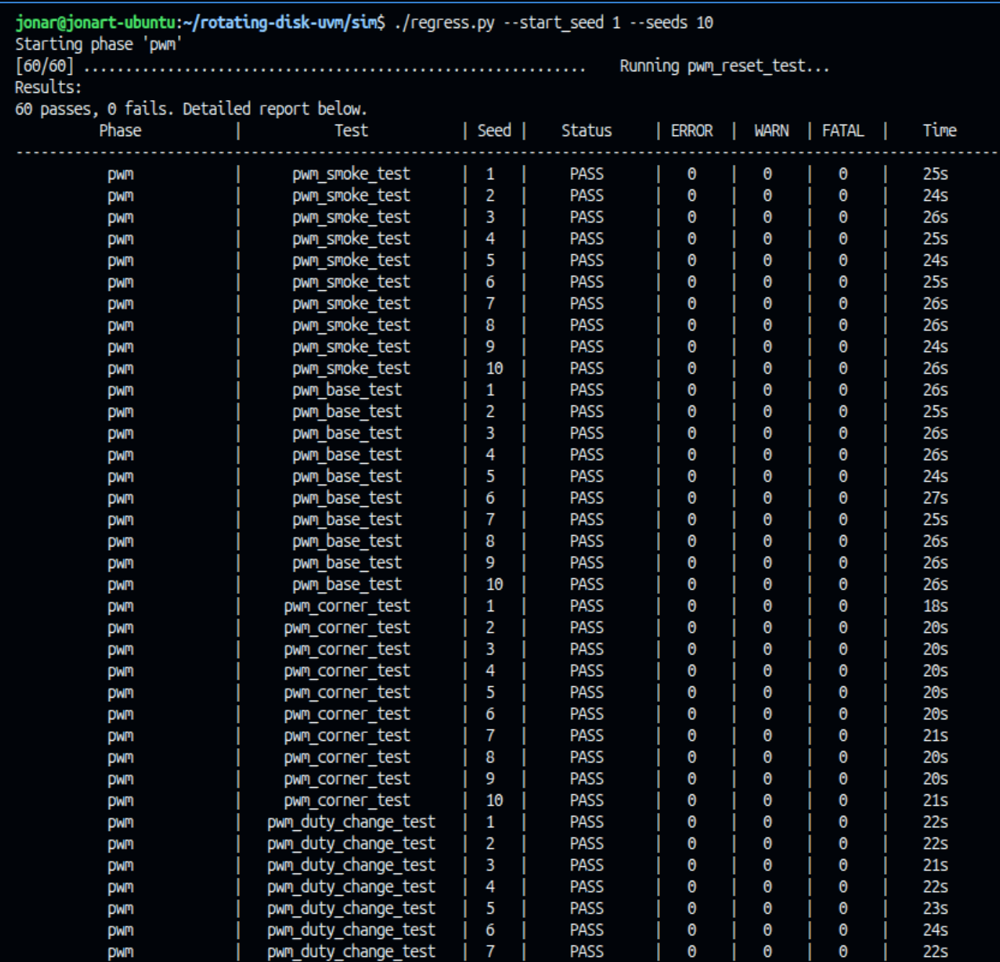

# Rotating Disk Controller — UVM Verification Environment

A UVM testbench for a proportional position controller for a rotating disk: a quadrature
decoder, a magnitude clamp, an N-bit PWM generator, and the closed-loop controller that ties
them together. Constrained-random stimulus, self-checking scoreboards against golden models,
SVA bound to the RTL, and functional coverage, on Vivado XSim.

## Status

| Phase | DUT | State |
|---|---|---|
| A — `pwm` | `pwm_n_bit` | **Done.** Agent (plus an extended driver/item swapped in by factory override), env, scoreboard, coverage, bound SVA, 6 tests |
| B — `clamp` | `magnitude_clamp` | **Done.** Agent, env, scoreboard, coverage, bound SVA, 2 tests |
| C — `quad` | `decoder_to_32_bit` | **Not started.** All files are empty stubs |
| D — `ctrl` | `prop_ctrl_pwm` | **Not started.** Will reuse the `quad` agent (active) and `pwm` agent (passive) unchanged |

`PHASE=quad` and `PHASE=ctrl` do not build yet.

## About this project

This is a **learning project**. I am teaching myself UVM and am not a professional
verification engineer, so expect choices a practitioner would make differently.

**Every line of testbench code is written by me, by hand.** I use Claude for the surrounding
work: build order, explaining concepts, reviewing my code, and diagnosing failures.

`rtl/` is a vendored copy of my own coursework design, not verification work. Its source
commit and local changes are in [`rtl/PROVENANCE.md`](rtl/PROVENANCE.md). Requirement,
observation and finding IDs (`R-PWM-2`, `O-CLAMP-1`, `F-001`) used in assertions and logs are
defined in [`REQUIREMENTS.md`](REQUIREMENTS.md).

## Requirements

- Vivado XSim 2025.2, with its bundled UVM-1.2
- GNU make; Python 3.12+ for `regress.py`

The Makefile looks in `$HOME/Vivado/2025.2`; override with `XILINX_ROOT=<path>`. Vivado does
not need to be on `PATH`.

## Running

Everything runs from `sim/`:

```sh
cd sim
make                                                    # PHASE=pwm, TEST=pwm_base_test
make PHASE=clamp TEST=clamp_random_test SEED=42
make PHASE=hello TOP=tb_hello TEST=hello_test           # UVM smoke test
```

`make compile` and `make elab` stop early. `make help` lists the knobs.

| Knob | Default | Meaning |
|---|---|---|
| `PHASE` | `pwm` | `pwm`, `clamp`, `quad`, `ctrl`; selects `TOP=tb_<PHASE>_top`, `filelists/<PHASE>.f` and the snapshot |
| `TEST` | `<PHASE>_base_test` | UVM test class, passed as `+UVM_TESTNAME` |
| `SEED` | `1` | `-sv_seed` |
| `VERBOSITY` | `UVM_HIGH` | UVM report verbosity |
| `WAVES` | `0` | `1` dumps `logs/<phase>_<test>_<seed>.wdb` (needs `sim/waves.tcl`, which is not in the tree) |
| `COV` | `0` | `1` writes `xsim.covdb/<phase>_<test>_<seed>` |
| `TIMEOUT` | `20ms` | Global watchdog (`+UVM_TIMEOUT`) |
| `ERROR_CAP` | `20` | Aborts the run after this many `UVM_ERROR`s |

`make gui` opens interactive XSim.

**A run's exit code is not the verdict.** Open `logs/<phase>.<test>.<seed>.log` and look for
`UVM_ERROR : 0` and `UVM_FATAL : 0` in the report summary. Compile and elaboration logs are
`logs/xvlog.<phase>.log` and `logs/xelab.<phase>.log`.

### Regressions

`regress.py` runs every test in a phase across consecutive seeds and prints a results table.

```sh
./regress.py --phase pwm --start_seed 1 --seeds 10
./regress.py --phase clamp --test clamp_random_test --seeds 50 --cov
./regress.py --clear                                    # empty logs/
```



| Flag | Default | Meaning |
|---|---|---|
| `--phase` | all | Restrict to a phase; repeatable. Phases with tests: `pwm`, `clamp` |
| `--test` | all in phase | Run a single test |
| `--start_seed`, `--seeds` | `0`, `1` | First seed and how many consecutive seeds to run |
| `--cov` | off | Pass `COV=1` to every run |
| `--quitlimit` | `1000` | `UVM_ERROR` cap per run |
| `--clear` | — | Delete `sim/logs/` contents and exit |

Status comes from the UVM report summary, not the exit code: `PASS`; `FAIL` (any
`UVM_ERROR`/`UVM_FATAL`); `LIMITFAIL` (quit limit reached); `NOREPORT` (crashed, hung, or the
test never started); `TOOLFAIL` (`make` failed, usually compile or elab). The script exits 1
if any run did not pass.

### Coverage

```sh
./regress.py --phase clamp --seeds 10 --cov             # collect
make cov PHASE=clamp                                    # merge
```

`make cov` merges every `xsim.covdb/<phase>_*` database into
`cov_report/<phase>/functionalCoverageReport/dashboard.html`. Narrow the merge with
`COV_GLOB='clamp_clamp_random_test_*'`.

### Cleaning

`make clean` removes build artifacts, logs and waveforms. `make veryclean` also removes
coverage databases and reports.

## Layout

```
rtl/                    DUT, vendored and never edited for testbench convenience
tb/
  common/               Interfaces, dut_pkg golden models, bufg_stub
    sva/                Assertion modules; sva/bind/ holds the bind files
  agents/<x>_agent/     Item, driver, monitor, agent, wrapped by <x>_agent_pkg
  env/                  <phase>_env_pkg: agent + scoreboard + coverage
  sequences/            Sequences, shared by the tests
  tests/                <phase>_tests_pkg: test classes
  top/                  tb_<phase>_top: clock, DUT, interface, config_db, run_test()
    scrap/              Throwaway experiments, gitignored
sim/
  Makefile, regress.py
  filelists/            <phase>.f: compile order and `-i` include dirs
```

## Conventions

- **Golden models** are pure functions in `dut_pkg`, with no state and no UVM dependency.
- **Assertions** are separate modules attached with `bind`, so `rtl/` stays exactly as it
  synthesizes.
- **Interfaces** carry clocking blocks and DRV/MON modports. They stay parameter-free so
  `virtual` handles work; `pwm_if` uses a wide `MAX_BITS` bus that the top narrows to the DUT.
- **Parameters** (`BITS`, `THRESHOLD`, …) reach the testbench through `uvm_config_db`, set from
  the top, never as class parameters.
- **Agents** gate the driver and sequencer on `get_is_active()`. The monitor and analysis port
  always exist, so an agent can be reused passively.
- **`clock_div`** instantiates a Xilinx `BUFG`; `tb/common/bufg_stub.sv` stands in for it and
  is needed only for Phase D.

Out of scope on purpose: `debounce`, `enel453_lab_initializer`, `status_7seg`, and the ROM
playback path.
